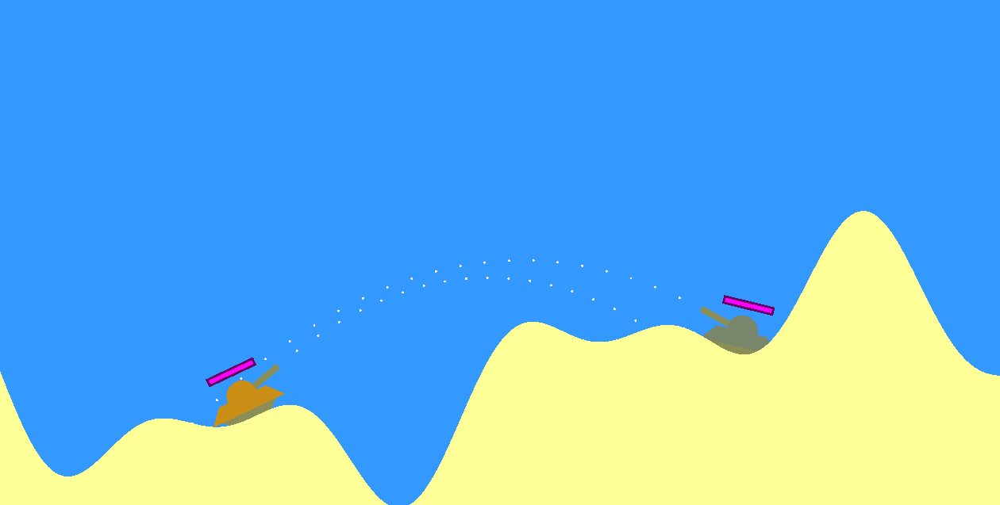
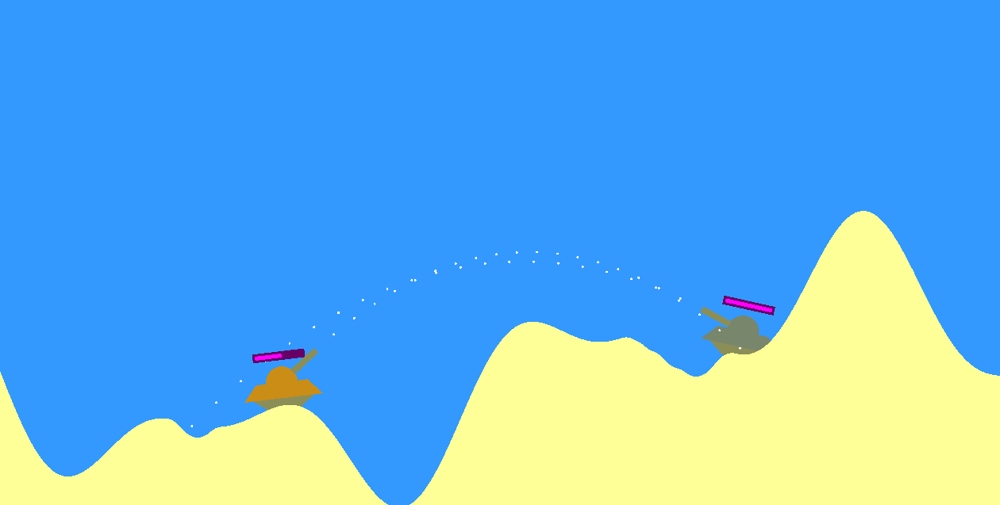
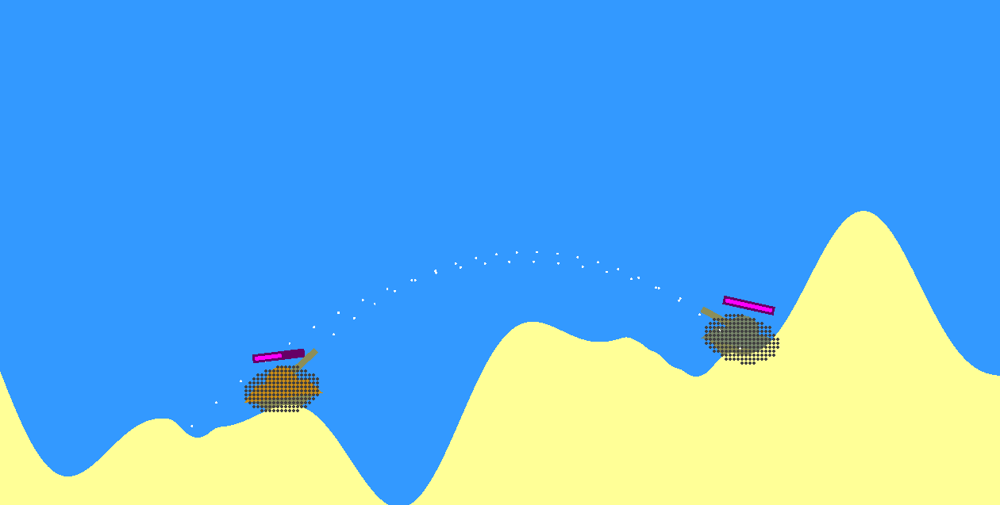

# TankWars

## :sparkles: Introduction

This project is a concept for a 2D game engine, written in C++ and using OpenGL. The game showcase two tanks fighting each other in a destructible environment.

## :video_game: Game Features

- Health system
- Aim assist
- Destructible terrain
- Realistic tank movement
- Hitbox display

## :keyboard: KEYBINDINGS

-  Player 1:
    - W: Rotate turret left 
    - S: Rotate turret right
    - A: Move left
    - D: Move right
    - Space: Shoot
- Player 2:
    - Up Arrow: Rotate turret left
    - Down Arrow: Rotate turret right
    - Left Arrow: Move left
    - Right Arrow: Move right
    - Enter: Shoot
## Pictures

